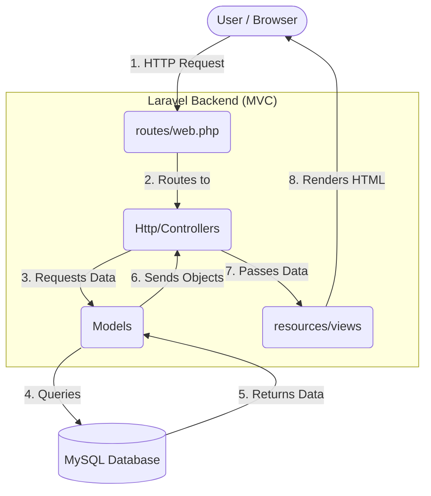
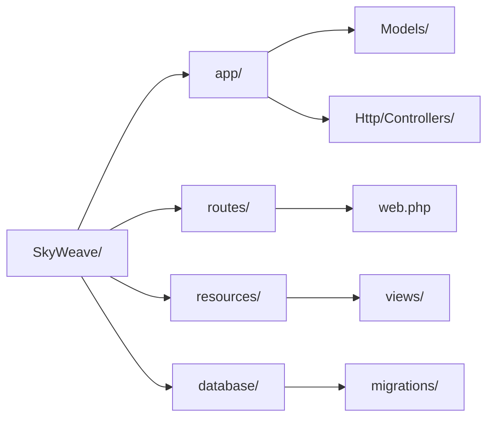

# ✈️ SkyWeave Project Documentation
## Installment 1: Project Overview & Architecture

> [!NOTE]
> **What is SkyWeave?**
> SkyWeave is a comprehensive web-based application built using the **Laravel Framework**. It is designed to manage and visualize aeronautical data, specifically focusing on **Waypoints**, **NAVAIDs (Navigational Aids)**, and **ATS (Air Traffic Service) Routes**.

The core purpose of the application is to allow users to dynamically create, manage, and map out flight paths or air traffic routes. It features an interactive mapping interface powered by the **Google Maps JavaScript API** to visualize the waypoints, NAVAIDs, and the routes constructed connecting these points with accurate geopolitical boundaries and premium cartography.

---

### 1. Architectural Pattern: MVC (Model-View-Controller)

SkyWeave strictly adheres to the **Model-View-Controller (MVC)** architectural pattern provided by Laravel. This ensures a clean separation of concerns.

| Layer | Description | Location |
| :--- | :--- | :--- |
| **Model** | Data layer. Represents database tables and contains business logic (e.g. distance calculation). | `app/Models/` |
| **View** | Presentation layer. Renders UI using Blade templating engine. | `resources/views/` |
| **Controller** | Logic layer. Handles HTTP requests, processes data, and returns the correct View. | `app/Http/Controllers/` |

---

### 2. Core Features & Data Flow

> [!TIP]
> **Data Flow Highlight**
> The application is primarily driven by user actions in the view, which trigger controllers to modify models and update the database, instantly reflecting on the Google Maps-powered map via internal API endpoints.

1. **Authentication & Authorization:** Uses Laravel Breeze/Auth to handle user login and registration securely. Routes are protected using the `auth` middleware.
2. **Waypoint & NAVAID Management:** Full CRUD capabilities for navigational points.
3. **Session-based Route Builder:** A unique feature that uses the user's session to build an ATS route dynamically before saving it to the database.
4. **Interactive Map Visualization:** An API layer (`MapApiController`) provides JSON data consumed by the frontend using the **Google Maps JavaScript API** to render the map. The map uses a custom dark JSON style array to match SkyWeave's premium aesthetic.
5. **Environment Configuration:** The Google Maps API key is stored securely in `.env` as `GOOGLE_MAPS_API_KEY` and accessed via Laravel's `config('services.google_maps.key')` pattern.

---

### 3. High-Level Directory Structure

---
*This concludes Installment 1.*
