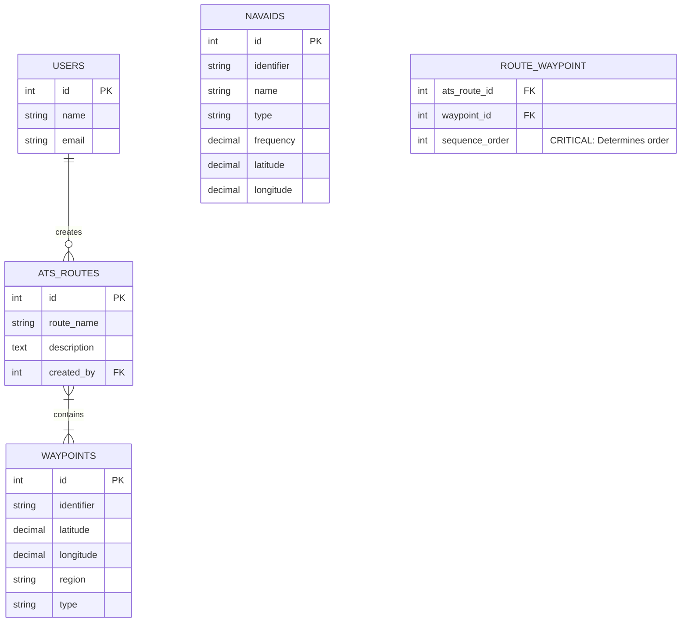

# ✈️ SkyWeave Project Documentation
## Installment 2: Database Models, Migrations, and Relationships

> [!NOTE]
> This section covers the data layer. Understanding how data is stored, structured, and interconnected is crucial. Laravel uses **Eloquent ORM** to interact with the database.

### 1. Database Schema & Entity Relationships

The core of the application relies on heavily relational data. To visualize how these tables interact, review the Entity-Relationship Diagram below:



---

### 2. The Models and Their Logic

#### A. The `Waypoint` Model
A waypoint represents a specific geographic location.
- **Relationship:** Many-to-Many with `ATSRoute` via `route_waypoint` pivot table.

#### B. The `Navaid` Model
Represents ground-based radio beacons (VOR, DME, NDB).
- **Note:** In the current architecture, NAVAIDs act as standalone reference points and are visualized on the map, but are not directly tied to ATS Routes.

#### C. The `ATSRoute` Model
Represents an Air Traffic Service route (a string of waypoints).

> [!IMPORTANT]
> **The Pivot Table (`route_waypoint`)**
> Because a Route has many Waypoints, and a Waypoint can be in many Routes, we need a **Pivot Table**. 
> The `sequence_order` column is **highly important.** It tells the system *where* the waypoint sits in that specific route. Without this, drawing a line on a map would result in a chaotic zig-zag.


#### D. Business Logic: Distance Calculation

The `calculateDistance()` method in `ATSRoute` uses the **Haversine formula** to calculate the great-circle distance between each consecutive pair of waypoints.

```php
// Snippet of the Haversine Logic
public function calculateDistance(): float
{
    // Iterates through ordered waypoints...
    // Returns total distance in Nautical Miles (NM)
}
```

---
*This concludes Installment 2.*
