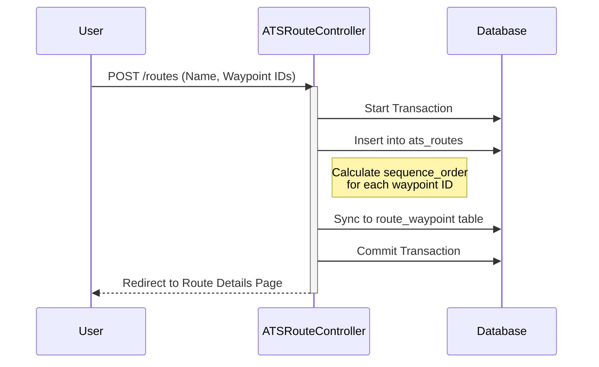

# ✈️ SkyWeave Project Documentation
## Installment 3: Controllers, Routing, and Session Management

This section explains the **"Logic Layer"** (Controllers), how HTTP requests reach that logic (Routing), and how SkyWeave handles temporary state using PHP Sessions.

### 1. The Routing Layer (`routes/web.php`)

> [!TIP]
> **Resource Routing**
> Instead of manually defining 7 routes for CRUD operations, SkyWeave utilizes `Route::resource('waypoints', WaypointController::class)`. This automatically handles index, create, store, show, edit, update, and destroy actions.

### 2. Complex Logic: Saving an ATS Route

The `ATSRouteController` handles the complex logic of saving a full Air Traffic Route to the database.

> [!WARNING]
> **Data Integrity**
> The `store()` method wraps the creation process in a `DB::transaction()`. If the route saves, but the pivot table `sync` fails, everything is rolled back, preventing orphaned data.



### 3. The Interactive "Draft Route" Engine

Building a route takes time. Doing this directly in the database is inefficient. Instead, SkyWeave uses **Laravel Sessions** to store a temporary "Draft".

```mermaid
flowchart TD
    Click[User Clicks 'Add to Route'] --> JS[Alpine.js State Updates]
    JS --> UI[UI Redraws Instantly]
    JS --> Form[Hidden Inputs Updated]
    
    Form -.-> Submit[User Clicks 'Create Route']
    Submit --> Store(ATSRouteController@store)
```

**How `DraftRouteController` works:**
- It uses a session key named `draft_route.waypoints` which holds an array of Waypoint IDs (e.g., `[5, 12, 3, 8]`).
- Methods like `addWaypoint()`, `removeWaypoint()`, and `reorderWaypoints()` manipulate this array without touching the database tables.

---

### 4. The Data API (`MapApiController.php`)

The Google Maps JavaScript API frontend needs raw JSON data, not HTML pages. The `MapApiController` provides lightweight endpoints that return pure JSON:

| Endpoint | Data Returned | Google Maps Usage |
| :--- | :--- | :--- |
| `/api/map/waypoints` | Waypoint coordinates + identifiers | Rendered as SVG circle `google.maps.Marker` icons |
| `/api/map/navaids` | NAVAID coordinates + type + name | Rendered as color-coded hollow circle markers |
| `/api/map/routes` | Route paths with ordered waypoints | Rendered as dashed `google.maps.Polyline` objects |

> [!IMPORTANT]
> **Pivot Ordering**
> When returning routes, `MapApiController` explicitly loads the waypoints relationship and orders them by `sequence_order`. If this wasn't done, the map would draw lines connecting waypoints in a random web!

---
*This concludes Installment 3.*
