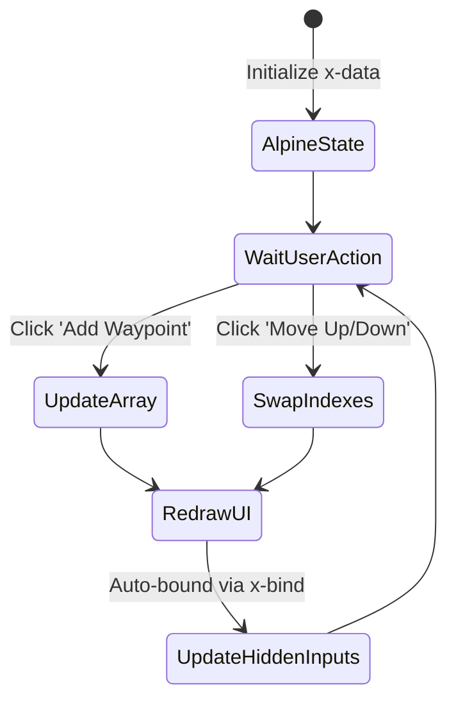
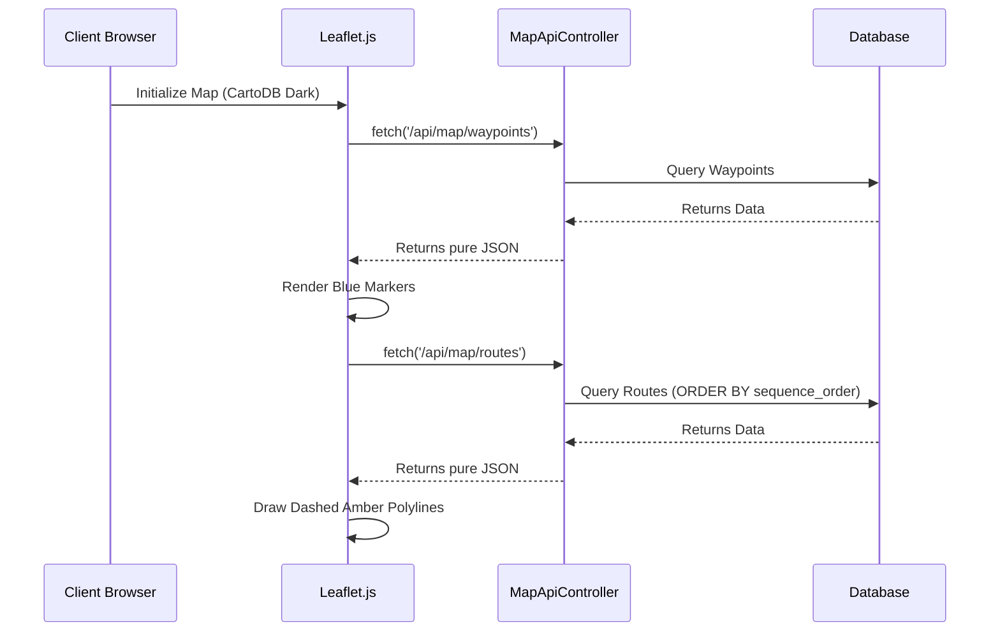

# ✈️ SkyWeave Project Documentation
## Installment 4: Views, Frontend, and Map Integration

This final installment covers the **"View Layer"** and how the frontend utilizes JavaScript to create a modern, reactive, and visually impressive user interface.

### 1. Blade Templating System
Laravel uses the **Blade** templating engine, allowing seamless injection of PHP variables into HTML.

| Feature | Description | SkyWeave Usage |
| :--- | :--- | :--- |
| **Layouts** | `<x-app-layout>` wrapper | Ensures consistent styling (navbar, footer) across all pages. |
| **Directives** | `@foreach`, `@if` | Loops through database records to render table rows or dropdown options. |

---

### 2. Alpine.js: Reactive UI Without the Heavy Lifting

SkyWeave utilizes **Alpine.js**, a lightweight declarative framework, instead of a heavy SPA framework like React. 

> [!TIP]
> **Why Alpine.js?**
> On the "Build Route" page (`routes/create.blade.php`), doing an AJAX request or page refresh every time a user moves a waypoint up or down the list would be extremely slow. Alpine maintains an internal `routeWaypoints` array in memory and instantly redraws the UI.

---

### 3. Global Aviation Map (Leaflet.js)

The centerpiece of the Dashboard (`dashboard.blade.php`) is the Interactive Global Aviation Map.

**Key Map Implementations:**
1. **The Base Layer:** Uses `CartoDB Dark Matter` to match SkyWeave's premium aesthetic.
2. **Dynamic Coloring:** NAVAIDs are color-coded based on their `type` (e.g., VORs are Green, TACANs are Pink, NDBs are Orange).
3. **Layer Controls:** Custom checkboxes trigger `toggle-map-layer` events, telling Leaflet to instantly `map.removeLayer()` or `map.addLayer()` without reloading the data.

---
*This concludes the complete technical documentation for SkyWeave.*
