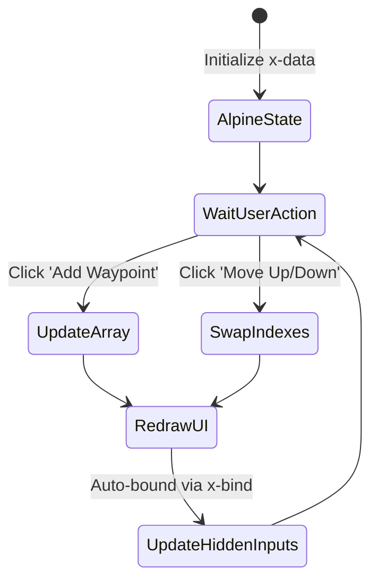
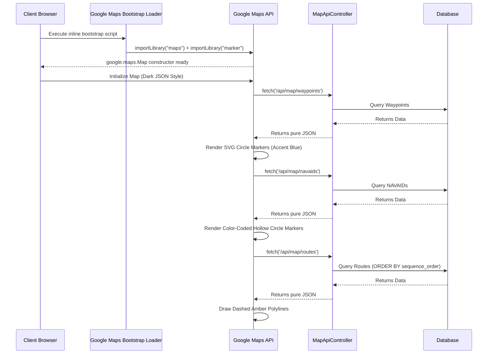

# ✈️ SkyWeave Project Documentation
## Installment 4: Views, Frontend, and Map Integration

This final installment covers the **"View Layer"** and how the frontend utilizes JavaScript to create a modern, reactive, and visually impressive user interface.

### 1. Blade Templating System
Laravel uses the **Blade** templating engine, allowing seamless injection of PHP variables into HTML.

| Feature | Description | SkyWeave Usage |
| :--- | :--- | :--- |
| **Layouts** | `<x-app-layout>` wrapper | Ensures consistent styling (navbar, footer) across all pages. |
| **Directives** | `@foreach`, `@if` | Loops through database records to render table rows or dropdown options. |
| **Stacks** | `@push('scripts')` / `@stack('scripts')` | Pages push their JavaScript into a named stack that the layout renders at the bottom of `<body>`. |

---

### 2. Alpine.js: Reactive UI Without the Heavy Lifting

SkyWeave utilizes **Alpine.js**, a lightweight declarative framework, instead of a heavy SPA framework like React. 

> [!TIP]
> **Why Alpine.js?**
> On the "Build Route" page (`routes/create.blade.php`), doing an AJAX request or page refresh every time a user moves a waypoint up or down the list would be extremely slow. Alpine maintains an internal `routeWaypoints` array in memory and instantly redraws the UI.



---

### 3. Global Aviation Map (Google Maps JavaScript API)

The centerpiece of the Dashboard (`dashboard.blade.php`) is the Interactive Global Aviation Map, powered by the **Google Maps JavaScript API**.

> [!NOTE]
> **Why Google Maps?**
> SkyWeave originally used Leaflet.js with OpenStreetMap/CartoDB tiles. This was replaced with Google Maps to ensure **accurate geopolitical boundaries** (e.g., correct India borders) and to leverage Google's premium cartography, satellite imagery, and vector rendering.



---

### 4. Map Architecture Deep-Dive

#### 4.1 API Key & Configuration

The Google Maps API key is managed through Laravel's configuration system:

```
.env                          →  GOOGLE_MAPS_API_KEY=AIzaSy...
config/services.php           →  'google_maps' => ['key' => env('GOOGLE_MAPS_API_KEY', '')]
layouts/app.blade.php         →  config('services.google_maps.key')
```

> [!IMPORTANT]
> **API Key Security**
> The API key is loaded server-side via Blade's `{{ config() }}` and injected into the bootstrap loader script. It should be restricted to your domain(s) in the Google Cloud Console to prevent unauthorized usage.

#### 4.2 Async Bootstrap Loader

The Google Maps API is loaded using Google's official **Dynamic Library Import** pattern (the minified bootstrap loader in `app.blade.php`). This approach:
- Loads the API **asynchronously** without blocking page rendering
- Uses `google.maps.importLibrary()` to load specific modules on demand
- Returns a `Promise` that resolves when the library is fully ready
- Prevents the `google.maps.Map is not a constructor` error that occurs with naive script loading

#### 4.3 Dark Theme (JSON Style Array)

Instead of relying on third-party dark tile providers (like CartoDB Dark Matter), SkyWeave applies a **custom JSON style array** directly to the `google.maps.Map` constructor. This style:

| Feature | Color | Rationale |
| :--- | :--- | :--- |
| Land geometry | `#0f2240` | Matches Tailwind's `sky-950` dark palette |
| Water | `#071525` | Deep navy to contrast with land |
| Country borders | `#2d5a8a` | Subtle but visible boundary lines |
| Roads | `#162d50` | Barely visible, keeps focus on aviation data |
| POIs & Transit | Hidden | Removed entirely to reduce visual noise |
| Labels | `#4a7ab5` | Muted blue for geographic labels |

#### 4.4 Marker System

SkyWeave uses **SVG data URL icons** with `google.maps.Marker` to replicate the circle marker aesthetic:

| Data Type | Marker Style | Color Logic |
| :--- | :--- | :--- |
| **Waypoints** | Small filled circles (radius 4) | Accent blue (`#38bdf8` fill, `#0ea5e9` stroke) |
| **NAVAIDs** | Larger hollow circles (radius 6) | Color-coded by type: VOR `#10b981`, NDB `#f97316`, TACAN `#ec4899`, DME `#6366f1` |

#### 4.5 Layer Toggle System

The dashboard provides checkboxes (powered by Alpine.js) to show/hide data layers. The toggle mechanism uses `setMap()`:

```javascript
// Show layer: attach markers/polylines to the map
layers[layerName].forEach(item => item.setMap(map));

// Hide layer: detach from map (removes from rendering without destroying data)
layers[layerName].forEach(item => item.setMap(null));
```

> [!TIP]
> **No Data Reload**
> Toggling layers is instantaneous because it only changes the marker's map association. The data remains in memory — no API calls are made when toggling.

#### 4.6 Route Visualization (Polylines)

ATS routes are rendered as **dashed amber polylines** using Google Maps' symbol-based line pattern:

```javascript
const polyline = new google.maps.Polyline({
    path: path,
    geodesic: true,
    strokeOpacity: 0,              // Hide the base line
    icons: [{
        icon: { path: 'M 0,-1 0,1', strokeOpacity: 0.8, scale: 3 },
        offset: '0',
        repeat: '16px',            // Creates the dash pattern
    }],
});
```

#### 4.7 Route Detail Map (OverlayView Labels)

On the route detail page (`routes/show.blade.php`), waypoint labels are displayed **permanently** using a custom `google.maps.OverlayView` subclass called `WaypointLabel`. This positions a styled `<div>` element relative to each marker's screen coordinates, updating automatically as the user pans and zooms.

#### 4.8 InfoWindow Tooltips

Hovering over any marker or polyline opens a shared `google.maps.InfoWindow` with styled HTML content. Only one InfoWindow is open at a time (shared instance pattern), and it closes automatically on mouseout. The InfoWindow styling is overridden in `app.css` to match SkyWeave's dark theme.

---
*This concludes the complete technical documentation for SkyWeave.*
