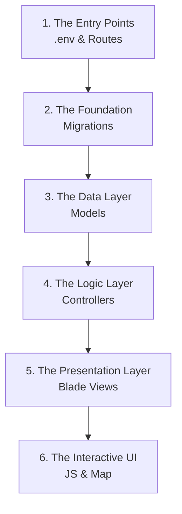

# ✈️ SkyWeave Project Documentation
## Installment 5: Codebase Study Guide

> [!NOTE]
> **Purpose of this Guide**
> When looking at a full-stack Laravel project for the first time, the sheer number of folders can be overwhelming. This guide provides the **exact sequence** you should follow to read the actual code files. By following this order, you will build your understanding from the foundation up, rather than jumping into complex logic without context.

---

### The Recommended Reading Sequence

---

### Step 1: The Entry Points & Configuration
Start here to understand what the application is connecting to and what URLs are available.

| Sequence | File Path | What to look for |
| :--- | :--- | :--- |
| **1.1** | `.env` | Look at the database connection variables (`DB_CONNECTION`, `DB_DATABASE`). This shows you how the app connects to the database. |
| **1.2** | `routes/web.php` | This is the **map of your application**. See how URLs (like `/routes/draft`) are linked to specific Controllers. Notice the difference between `Route::resource` and standard `Route::get/post`. |

---

### Step 2: The Foundation (Migrations)
Before you look at PHP logic, you must understand how the SQL database is structured. Open these files in the `database/migrations/` folder in chronological order.

| Sequence | File Path | What to look for |
| :--- | :--- | :--- |
| **2.1** | `...create_waypoints_table.php` | Look at the specific columns (`identifier`, `latitude`, `longitude`). |
| **2.2** | `...create_navaids_table.php` | Notice the differences between a Navaid and a Waypoint. |
| **2.3** | `...create_ats_routes_table.php` | Note the foreign key `created_by` linking to the users table. |
| **2.4** | `...create_route_waypoint_table.php` | **Critical:** This is the Pivot table. Look closely at the `ats_route_id`, `waypoint_id`, and `sequence_order` columns. |

---

### Step 3: The Data Layer (Models)
Now that you know the table structures, look at the PHP classes that represent them in `app/Models/`.

| Sequence | File Path | What to look for |
| :--- | :--- | :--- |
| **3.1** | `Waypoint.php` & `Navaid.php` | Look at the `$fillable` array to see what data can be mass-assigned. Notice the `casts` array forcing coords to decimals. |
| **3.2** | `ATSRoute.php` | Read the `waypoints()` method carefully. See how it uses `withPivot('sequence_order')` to maintain the route's path. |
| **3.3** | `ATSRoute.php` (Logic) | Scroll down to `calculateDistance()` and `haversineDistance()`. Understand how the model calculates the total route length in Nautical Miles. |

---

### Step 4: The Logic Layer (Controllers)
This is where the actual action happens. The Controller grabs data from the Models and passes it to the Views. Look in `app/Http/Controllers/`.

> [!WARNING]
> Don't try to read all controllers at once. Focus on one feature (like ATS Routes) from start to finish.

| Sequence | File Path | What to look for |
| :--- | :--- | :--- |
| **4.1** | `WaypointController.php` | A standard CRUD controller. Look at `index()` (fetching data) and `store()` (saving data). |
| **4.2** | `DraftRouteController.php` | Look at how the session is manipulated without touching the database (`session(['draft_route.waypoints' => ...])`). |
| **4.3** | `ATSRouteController.php` | Look at the `store()` method. Notice how `DB::transaction()` is used to save the route and immediately use `sync()` to insert data into the pivot table. |
| **4.4** | `MapApiController.php` | Notice how it returns `response()->json()` instead of views. This is the data bridge consumed by the Google Maps JavaScript API on the frontend. |

---

### Step 5: The Presentation Layer (Blade Views)
Now you see what the user sees. Look in `resources/views/`.

| Sequence | File Path | What to look for |
| :--- | :--- | :--- |
| **5.1** | `layouts/app.blade.php` | The master layout. Notice the `<slot>` tags where the page content is injected. Also observe the **Google Maps bootstrap loader** script — a minified self-executing function that loads the API asynchronously and makes `google.maps.importLibrary()` available. The API key is injected server-side via `config('services.google_maps.key')`. |
| **5.2** | `routes/index.blade.php` | See how `@foreach ($routes as $route)` is used to loop through data passed from the `ATSRouteController`. |

---

### Step 6: The Interactive UI (Alpine.js & Google Maps JavaScript API)
Finally, investigate how the views are made reactive without refreshing the page.

> [!TIP]
> **Reading Frontend JS**
> The JavaScript is usually located at the very bottom of the `.blade.php` files inside `@push('scripts')` tags.

| Sequence | File Path | What to look for |
| :--- | :--- | :--- |
| **6.1** | `routes/create.blade.php` | Scroll to the bottom and read the `routeBuilder()` function. Understand how Alpine.js creates the `routeWaypoints` array in the browser memory to handle re-ordering without hitting the server. |
| **6.2** | `dashboard.blade.php` | Scroll to the bottom. Read the Google Maps integration inside `initDashboardMap()`. Follow the code where `fetch()` calls your `MapApiController`, parses the JSON, and loops through the data to create `google.maps.Marker` (with SVG circle icons) and `google.maps.Polyline` objects. Notice the **dark theme JSON style array** and how layers are toggled using `setMap(map)` / `setMap(null)`. |
| **6.3** | `routes/show.blade.php` | Read the `initRouteMap()` function. Notice the custom `WaypointLabel` class that extends `google.maps.OverlayView` to create permanent floating labels next to each waypoint marker. |
| **6.4** | `resources/css/app.css` | Look at the "Google Maps Dark Theme Overrides" section at the bottom. See how CSS targets `.gm-style-iw-*` classes to restyle InfoWindow popups to match SkyWeave's dark palette. |

---

### Step 7: Environment & Configuration
Understand how external services are configured securely.

| Sequence | File Path | What to look for |
| :--- | :--- | :--- |
| **7.1** | `.env` | Look at `GOOGLE_MAPS_API_KEY` — this is the secret key that authenticates requests to the Google Maps API. It should never be committed to Git. |
| **7.2** | `config/services.php` | See how `env('GOOGLE_MAPS_API_KEY')` is wrapped in a config array, making it accessible via `config('services.google_maps.key')` throughout the application. |

---

### Final Advice for Your Presentation
If your teacher asks you to **"Show me how X works"**, follow the sequence in reverse if debugging, or forwards if explaining:
*User clicks button (View) → Hits URL (Route) → Triggers Logic (Controller) → Queries Data (Model/Database).*

**For the map specifically**, the flow is:
*Page loads → Google Maps bootstrap loader runs → `importLibrary()` resolves → `initDashboardMap()` creates the Map → `fetch()` calls hit `MapApiController` → JSON returned → Markers and Polylines drawn on map.*
